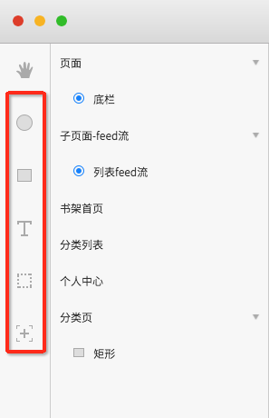

# 编辑

### 基础组件

编辑器中提供的基础组件包括：画板、弹性盒子、图片、文本、矩形、椭圆形

### 添加组件

在编辑器左侧工具栏中点击对应的icon使icon处于选中状态，然后移动鼠标到画布界面，拖拽绘制即生成对应的基础组件

基本组件的添加均设置有快捷方式，详见后文

### 画板

#### 快捷添加（A）

#### 截图示例

#### 使用说明

一个画板对应应用中的一个页面；画板可以调整大小、位置以及状态栏的设置；其他组件可以在设计器中拖进画板内

#### 子页面

在画板中设计一个结构复杂页面会显得比较臃肿，勾选画板为子页面后该页面可以作为其他页面的内嵌页面显示，子页面的内容编辑还是在该页面中进行

### 弹性盒子

#### 快捷键（F）

#### 截图示例

#### 使用说明

弹性盒子可以在属性面板中设置内部间距，设置内部元素的排列方向和排列方式

盒子内部元素为自动排列，当设置内部元素为定位布局后，可以对该元素拖动位置

拖动元素到盒子上，元素会被放进到盒子内

盒子保持内部元素不溢出，当元素超出盒子后，盒子会自动放大

### 图片

#### 添加方式

1. 可以从外部拖入图片文件放到编辑器中添加一张或多张图片
2. 先添加矩形、椭圆形到编辑其中，点开背景颜色选择器，切换到图片，选择模拟图片或者本地上传（第一个图标）

#### 截图示例

#### 使用说明

图片和矩形、椭圆形之间可以通过颜色图片选择器来进行切换

### 文本

#### 快捷键（T）

#### 使用说明

在编辑器中添加文本后，选中文本双击进行文本内容编辑

### 矩形、椭圆形

#### 快捷键（R/O）

### 成组、解组

#### 快捷键（Command+G/Command+Shift+G）

#### 说明

选中一个或多个元素成组

组可以使元素排列层次更清晰

组会根据组内元素的范围自动缩放大小

解组后，组内元素被释放到外部，组被移除

