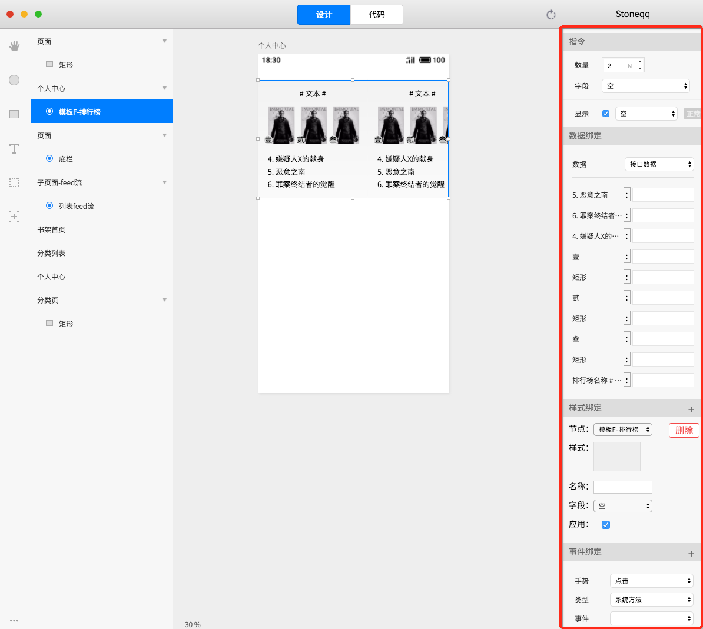

# 数据绑定

### 绑定

绑定内容包含如下：

1. 提供对文本、图片、组件的属性绑定
2. 提供单个元素的样式绑定
3. 提供单个元素的事件绑定
4. 提供单个元素的指令绑定
5. 提供weex组件的子页面绑定

### 截图

###  绑定属性

分为设计数据和接口数据绑定，设计数据对应到设计画布中的显示，接口数据被编译到代码中，根据接口实际数据渲染


视图上未绑定接口数据时，使用设计数据编译


#### 设计数据

根据属性类型，提供不同类型的绑定界面，例如：颜色选择器、文本输入框、图片选择器、switch等

对于文本和图片类型，提供系统的模拟数据供选中使用，选中模拟数据分类后，随机赋值

#### 接口数据

接口数据被设置为只能选中页面中的接口字段，未绑定的字段使用设计静态数据


页面的接口字段，需要在代码编辑面板中根据jsdoc规范写好注释，切回到设计面板时自动解析


### 事件绑定

### 指令绑定

### 样式绑定

