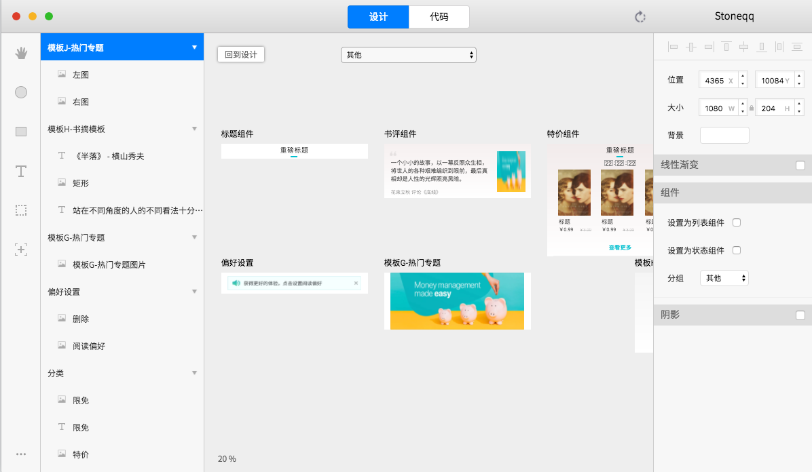
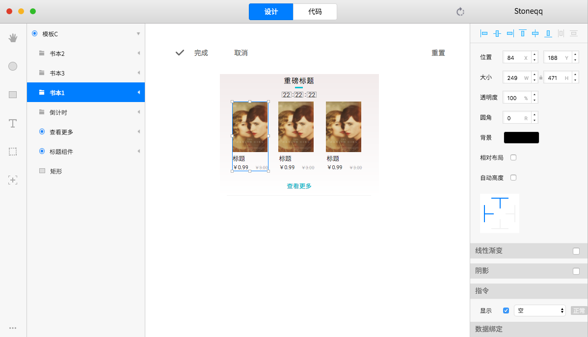
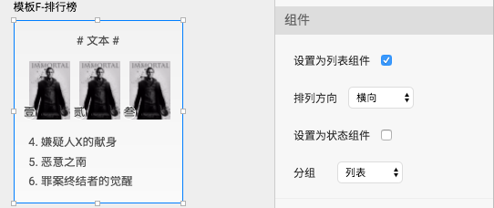
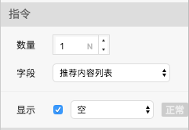

# 自定义组件

### 概述

自定义设计组件作为一个独立的结构体保存在项目组件库中，可以被重复使用，结合数据绑定呈现不同的视觉效果

### 源组件

在设计画布中右键菜单可以选择切换到组件画布，组件画布中，每一个画板代表了一个源组件；画板的功能和设计画板相同

### 截图示例

### 继承源组件

在组件面板修改源组件后，切回到设计画布，源组件所对应的所有引用组件都会自动同步更新，包括组件结构和样式

### 覆盖源组件

在设计界面可以对使用到的自定义设计组件进行局部编辑，在局部编辑状态下，编辑过的属性不再继承源组件的修改


进入局部编辑后，可以按Esc取消此次编辑

点击重置后，该组件以及编辑过的属性全部清空，重新继承源组件


### 列表组件

列表组件为自定义设计组件中较为常用的一种类型，需要在组件编辑面板中勾选【设置为列表组件】，并选列表排列方向

  
在设计画布中，列表组件可以调整数量，并绑定列表接口字段


列表组件外部只提供接口数据绑定，内部只提供设计数据绑定，事件绑定编译时取第一个节点数据


### 状态组件

