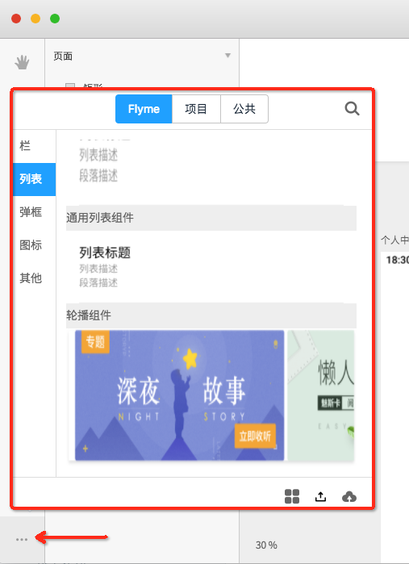

# 添加组件到画布

### 入口

在工具栏最底部点击选择组件按钮，弹出组件列表页面，切换类型或搜索需要的组件，选中拖拽添加到画布中

### 截图示例

### 说明

提供三大类组件：

1. Flyme组件，是系统开发的公共组件
2. 项目组件，是当前项目中自定义的设计组件
3. 公共组件，是多个项目共享的自定义设计组件

每个大类下分多个子分类，项目组件的子分类可以在导入组件时添加

面板右下方三个功能按钮暂未开放

