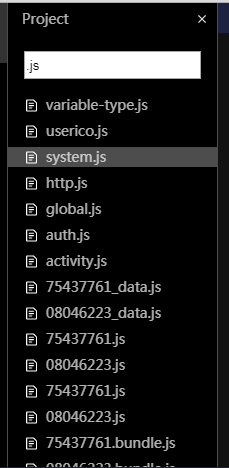

# 代码编辑器

代码编辑器的使用主要是面向开发者，大部分操作与vscode保持一致，提供与蚂蚁开发者工具一致的菜单操作，如下图： 

### ​文件树菜单

 不同的文件项会有不同的菜单，下面把所有菜单列出来： 

1. 新建文件
2. 新建文件夹
3. 粘贴
4. 复制
5. 从文件系统打开
6. 重命名 （在修改路径的时候，可以进行文件的移动）
7. 删除

### Tab的菜单栏操作

1. 关闭当前
2. 关闭其他

### 文件搜索

点击下图的右上的搜查按钮，可以切换到搜查的文件的状态。

输入文件名中包含的关键字可以进行文件查找。

