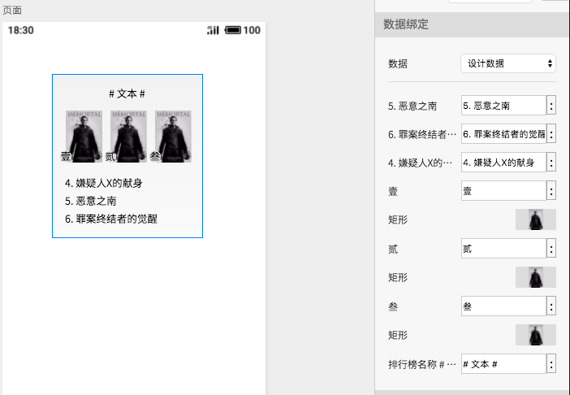
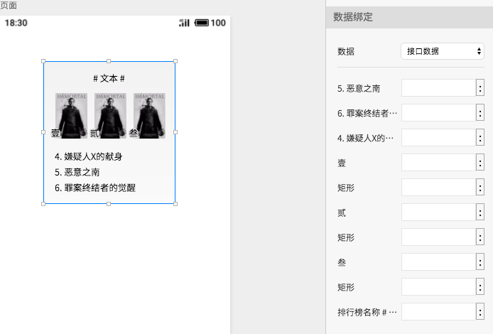
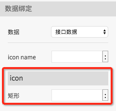

# 数据

### 设计数据

设计数据在设计器中显示，用于调整设计界面美观，可以填写或者选中模拟数据


图片的设计数据使用图片选择器编辑

文本的设计数据双击编辑



模拟数据在编辑器首页的模拟数据系统中添加


### 

### 接口数据


接口数据只能选择字段绑定

未绑定的字段，默认使用设计数据代替  



接口数据字段从编译后的页面js文件中解析


### 嵌套组件数据

嵌套组件属性会打平，数据绑定中显示属性归属组件名称


嵌套的列表组件不会打平到上级组件


