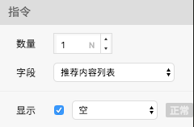

# 指令

绑定指令可以控制元素的显示逻辑



  


### 显示

用于控制元素是否显示，取消勾选时，在设计画布中不显示，和转码无关

也可以选择字段，根据接口字段绑定显示状态

可以切换绑定状态为 “正常” 或 “取反”

编译后的代码示例如下：

```markup
<FmSlider v-if="isBanners" class="CodeComponent60184282" ></FmSlider>
```


### 遍历

当选中元素为列表类型时，可以设置元素的数量，绑定遍历的字段

编译后的代码示例如下：

```markup
<list class="ListComponent34741584"> <cell class="DesignComponent20888852"> <div class="DesignComponent56534781"> <image class="MImage90683746" src="../images/90683746.webp"></image> <div class="FlexBox51313031"><text class="MText35370332" value="图书两行标题两行"></text><text class="MText21052415" value="作者"></text></div> </div> <div class="DesignComponent79465990"> <image class="MImage90683746" src="../images/90683746.webp"></image> <div class="FlexBox51313031"><text class="MText35370332" value="图书两行标题两行"></text><text class="MText21052415" value="作者"></text></div> </div> <div class="DesignComponent49259148"> <image class="MImage90683746" src="../images/90683746.webp"></image> <div class="FlexBox51313031"><text class="MText35370332" value="图书两行标题两行"></text><text class="MText21052415" value="作者"></text></div> </div> </cell> </list>
```


