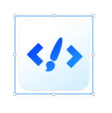

# 编辑工具

### 选择器

用于在画布中选择元素，提供以下选择方式：

1. 点击选中
2. shift + 点击 选中多个元素
3. 点击拖动鼠标，框选元素
4. 子节点通过双击选中

### 编辑器

编辑器根据当前选中元素的状态（可编辑、可移动），提供相应的编辑功能

编辑内容包括：元素位置、元素大小、元素属性  


编辑工具包括以下状态：可编辑、可移动、可选择


### 对齐辅助

在移动元素过程中，在元素间的距离在对齐范围内时，自动触发对齐，并表示辅助线


在移动过程中，按下Common键，可以取消辅助对齐功能


