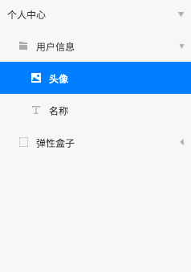

# 元素列表

显示当前画布中所有元素，可收放显示子节点

### 选择说明

点击选中该元素，显示选中状态，其他元素非选中状态

使用Command + 点击，可选中多个元素

使用shift + 点击，可以选中区域内元素

### 编辑说明

双击名称，进入名称编辑状态，回车完成编辑

双击名称外其他空白区域，在画布中定位该元素到中心

### 隐藏元素

鼠标移入，显示隐藏按钮，点击隐藏按钮在画布中隐藏该元素

### 拖拽

拖动元素，可以改变元素的位置，也可以拖入到新的父节点，或拖出当前父节点

### 右键菜单

选中元素后，可以右键操作，右键菜单和设计画布中功能保持一致

