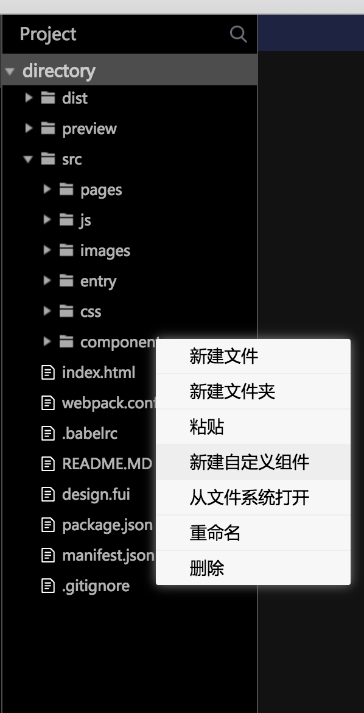

# 自定义代码组件开发

## 教程引导

进入代码面板，在右侧文件列表鼠标悬停到src/components目录上，鼠标右键出现菜单列表，选择新建自定义组件




到这里，已经在components目录下创建了about组件，下面有两个文件index.vue是自定义组件的代码实现， export.js是代码组件要在设计面板中使用时的描述信息。编辑器会根据规则编译components目录下代码组件，然后同步到设计面板中。

export.js描述文件结构说明，可在该文件中查看参考文档。

```text
/**
 * 参考文档 http://gitlab.meizu.com/wanghao/UIDesign/blob/master/doc/%E5%85%AC%E5%85%B1%E7%BB%84%E4%BB%B6%E7%BB%93%E6%9E%84%E6%8F%8F%E8%BF%B0%E5%8D%8F%E8%AE%AE.MD
 */
(config => config)( {
	name: 'about', // name要和components目录下的组件名保持一致
	desc: 'about 组件',// desc 就是在组件面板上显示的名字
	slots: null,
	props: {  // 这里是组件的相关属性信息
		backgroundColor: {
			type: 'COLOR',
			desc: '背景颜色',
			default: '#FFFFFF'
		}
	},
	events: { //组件的事件绑定信息
		click: {
			desc: '按钮被点击'
		}
	},
	size: {  //组件大小
		width: 1080,
		height: 144
	}
});

```

同步组件到设计面板\(组件需要编译，才能同步到设计面板，所以模拟器要打开运行，才能同步组件\)


同步到设计面板后，可以在项目的自定义组件中使用。


## 组件更新

组件代码修改后，再次同步组件即可更新设计面板的组件

## 


